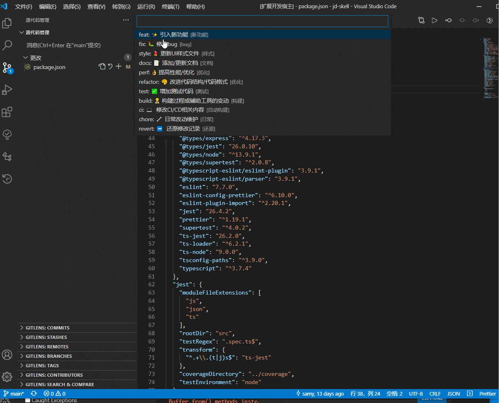

<h1 align="center">
   
    
   
   Git CZ Emoji
   
   
</h1>
<h4 align="center">A tool that help add git commit cz prefix with emoji.</h4>

<!-- 

  
  
  
  

 -->

在 VScode 中提交 git 的时候添加 cz规范 emoji 前缀

## 安装
方式1：插件商店搜索 `Git CZ Emoji` 即可找到该插件

方式2：访问 [vscode 网上商店](https://marketplace.visualstudio.com/items?itemName=yessz.git-cz-emoji-vsc) 进行安装

方式3：~~github搜索`git-cz-emoji-vsc`,下载git-cz-emoji-vsc*.vsix文件~~

## 使用
任意单个源代码管理上方点击图标进入或使用 command+shift+p 输入 `Git CZ: generate prefix msg` 打开 git cz 插件。

有三种模式切换：
- emoji模式；
- emoji对应的code模式；
- 纯cz提交模式；

## 说明

|   类型   | emji |           描述            |
| :------: | :--: | :-----------------------: |
|   feat   |  ✨  |       引入新功能         |
|   fix    |  🐛  |       修复 bug          |
|  style   |  💄  |       更新 UI 样式文按键  |
|  format  |  🥚  |       格式化代码         |
|   docs   |  📝  |       添加/更新文档       |
|   perf   |  👌  |       提高性能/优化       |
| refactor |  🎨  |       改进代码结构/代码格式 |
|   test   |  ✅  |       增加测试代码        |
|   build  |  👷  |       构建过程或辅助工具的变动 |
|   ci     |  💻  |       修改CI/CD相关内容   |
|   chore  |  🔧  |       日常改动维护   |
|   revert |  ⏪  |       还原修改记录   |

## 演示

